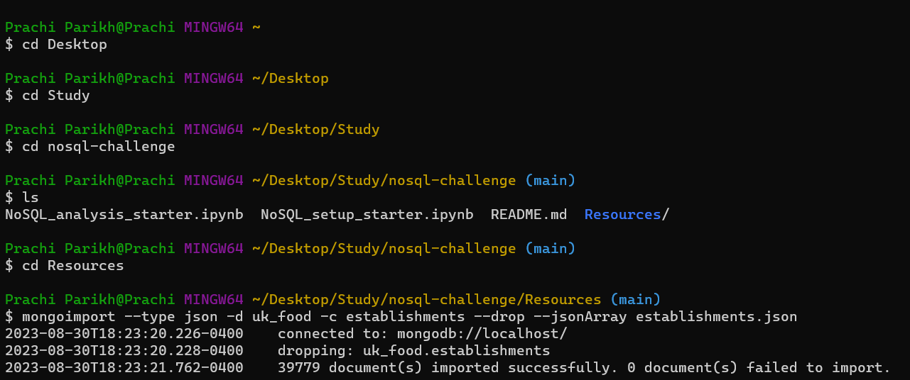

# nosql-challenge

## Part 1: Database and Jupyter Notebook Set Up
Use NoSQL_setup_starter.ipynb for this section of the challenge.
1. Import the data provided in the establishments.json file from your Terminal. Name the database uk_food and the collection establishments. Copy the text you used to import your data from your Terminal to a markdown cell in your notebook.

   

2. Within your notebook, import the libraries you need: PyMongo and Pretty Print (pprint).
3. Create an instance of the Mongo Client.
4. Confirm that you created the database and loaded the data properly:
    1. List the databases you have in MongoDB. Confirm that uk_food is listed.
    2. List the collection(s) in the database to ensure that establishments is there.
    3. Find and display one document in the establishments collection using find_one and display with pprint.

5. Assign the establishments collection to a variable to prepare the collection for use.

## Part 2: Update the Database
Use NoSQL_setup_starter.ipynb for this section of the challenge.

The magazine editors have some requested modifications for the database before you can perform any queries or analysis for them. Make the following changes to the establishments collection:
1. An exciting new halal restaurant just opened in Greenwich, but hasn't been rated yet. The magazine has asked you to include it in your analysis. Add the following information to the database:
2. Find the BusinessTypeID for "Restaurant/Cafe/Canteen" and return only the BusinessTypeID and BusinessType fields.
3. Update the new restaurant with the BusinessTypeID you found.
4. The magazine is not interested in any establishments in Dover, so check how many documents contain the Dover Local Authority. Then, remove any establishments within the Dover Local Authority from the database, and check the number of documents to ensure they were deleted.
5. Some of the number values are stored as strings, when they should be stored as numbers.
   1. Use update_many to convert latitude and longitude to decimal numbers.
   2. Use update_many to convert RatingValue to integer numbers.

## Part 3: Exploratory Analysis
Eat Safe, Love has specific questions they want you to answer, which will help them find the locations they wish to visit and avoid.

Use NoSQL_analysis_starter.ipynb for this section of the challenge.
Question 1: Which establishments have a hygiene score equal to 20? 
  1. A query is correctly performed to find the establishments with a hygiene score of 20
  2. count_documents() is used to list the correct number of documents
  3. The first result is printed using pprint
  4. The results are converted to a Pandas DataFrame and displays the first 10 rows 
          
Question 2: Which establishments in London have a RatingValue greater than or equal to 4?
   1. A query is correctly performed to find the establishments in London with a RatingValue greater than or equal to 4
   2. The query uses the $regex operator to locate the London establishments
   3. count_documents() is used to list the correct number of documents
   4. The first result is printed using pprint
   5. The results are converted to a Pandas DataFrame and displays the first 10 rows

Question 3: What are the top 5 establishments with a RatingValue of 5, sorted by lowest hygiene score, nearest to the new restaurant added, "Penang Flavours"? 
   1. A query is correctly performed to find the establishments within 0.01 degree of the "Penang Flavours" restaurant
   2. The query also limits the results to establishments with a RatingValue of 5
   3. The query uses the sort() method in PyMongo to sort in ascending order on the hygiene score
   4. The query uses the limit() method in PyMongo to limit the results to 5
   5. All five results are printed using pprint
   6. The results are converted to a Pandas DataFrame and displayed

Question 4: How many establishments in each Local Authority area have a hygiene score of 0? Sort the results from highest to lowest, and print out the top ten local authority areas.
   1. An aggregation pipeline is built to include a match query, group, and sort
   2. The match query matches documents with a hygiene score of 0
   3. The group step of the pipeline is grouped on LocalAuthorityName and counts the number of documents
   4. The sort step of the pipeline sorts the count of the documents in descending order
   5. The aggregation pipeline is correctly sent to the aggregate
   6. The results from the aggregation query is cast as a list and then saved to a variable
   7. The first ten results are printed using pprint (
   8. The results are converted to a Pandas DataFrame and displays the first 10 rows 
